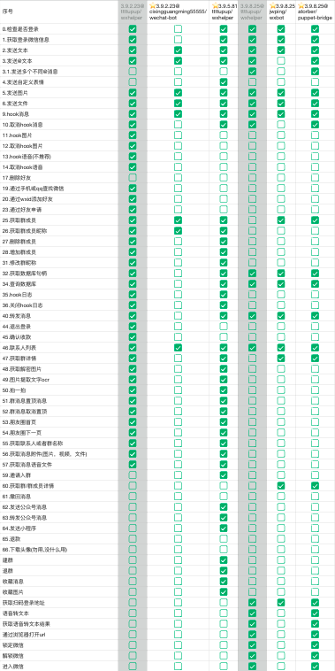

# Wechaty Puppet Bridge

  [](https://github.com/atorber/puppet-bridge/actions?query=workflow%3ANPM)
[](https://www.npmjs.com/package/wechaty-puppet-bridge)
[](https://www.npmjs.com/package/wechaty-puppet-bridge?activeTab=versions) 


## 简介

wechaty-puppet-bridge 是一个虚拟的Wechaty Puppet，实际上它只是一个桥接服务，它将GitHub中开源的机器人桥接到Wechaty，是开源IM bot搬运工

如果你想方便且高效的使用免费的机器人，那么它是一个很好的选择，它不需要token同时又能使用Wechaty进行聊天机器人开发

获取更多信息[访问项目语雀文档](https://www.yuque.com/atorber/chatflow/mean34ibdoonvox4)

## 功能清单

wechaty-puppet-bridge 是一个全新的wechaty-puppet，它可以连接所有的通过ws、http、mqtt开放IM访问的聊天机器人.

> 最新功能清单查看[功能清单](https://www.yuque.com/atorber/chatflow/imovlh1l8ypxmd9n#eTg6)



## 机器人支持

1. Wechat-bot 馈人玫瑰之手，历久犹有余香 [cixingguangming55555/wechat-bot](https://github.com/cixingguangming55555/wechat-bot)

2. wxbot - 聊天机器人 [jwping/wxbot](https://github.com/jwping/wxbot)

3. wxhelper - PC端微信逆向学习 [ttttupup/wxhelper](https://github.com/ttttupup/wxhelper)

## 快速开始

### 使用[jwping/wxbot](https://github.com/jwping/wxbot)

1. 在您的Windows电脑上安装客户端（需要版本v3.9.8.25,下载[v3.9.8.25](https://github.com/tom-snow/wechat-windows-versions/releases/tag/v3.9.8.25)）

2. 在电脑上登录客户端

3. 运行以下指令启动程序

```sh
git clone https://github.com/atorber/puppet-bridg
cd puppet-bridge

# 安装依赖
npm install

# 启动程序
npm run start:ripe-bridge-jwping-wxbot:info
#
# Do not forget to install WeChat with requried version and login.
#
```

## 使用NPM包

puppet-bridge 已经在NPM上发布了安装包，Wechaty用户可以直接安装使用

```shell
npm i wechaty-puppet-bridge
```

## 更多示例代码

|源|WeChat版本|使用|安装|
|--|--|--|--|
|[lich0821/WeChatFerry](https://github.com/lich0821/WeChatFerry)|v3.9.10.27|[示例代码](./examples/ripe-wechaty-lich0821-WeChatFerry-3091027.ts) |npm i wechaty-puppet-bridge@0.15.0|
|[jwping/wxbot](https://github.com/jwping/wxbot)|v3.9.8.25|[示例代码](./examples/ripe-wechaty-jwping-wxbot-3090825.ts)|npm i wechaty-puppet-bridge@0.15.0|
|[ttttupup/wxhelper](https://github.com/ttttupup/wxhelper/tree/dev-3.9.2.23)|v3.9.2.23|[示例代码](./examples/ripe-wechaty-ttttupup-wxhelper-3090223.ts) (需要【以管理员身份运行】WeChat客户端)|npm i wechaty-puppet-bridge@0.15.0|
|[ttttupup/wxhelper](https://github.com/ttttupup/wxhelper/tree/dev-3.9.5.81)|v3.9.5.81|[示例代码](./examples/ripe-wechaty-ttttupup-wxhelper-3090581.ts) (需要【以管理员身份运行】WeChat客户端)|npm i wechaty-puppet-bridge@0.15.0|
|[ttttupup/wxhelper](https://github.com/ttttupup/wxhelper/tree/dev-3.9.8.25)|v3.9.8.25|[示例代码](./examples/ripe-wechaty-atorber-fused-3090825.ts) (需要【以管理员身份运行】WeChat客户端)|npm i wechaty-puppet-bridge@0.15.0|
|[ttttupup/wxhelper](https://github.com/ttttupup/wxhelper/tree/dev-3.9.10.19)|v3.9.10.19|[示例代码](./examples/ripe-bridge-ttttupup-wxhelper-3091019.ts) (需要【以管理员身份运行】WeChat客户端)|npm i wechaty-puppet-bridge@0.15.0|

## API接口

Puppet Bridge是对开源bot项目的API封装，并不会对原生的API进行修改，因此你依然可以使用底层bot的原生API进行开发，以下主要对wxhelper原生API进行说明

### HTTP API

[3.9.9.43版本接口](https://github.com/ttttupup/wxhelper/blob/dev-3.9.10.19/doc/3.9.9.43.md)兼容3.9.10.19

### WEB HOOK

wxhelper要求用户启动一个websoket服务接收数据，Puppet Bridge中已经启动了一个websoket服务并将从wxhelper接收到的数据转发给所有的客户端，你只需要连接该服务即可订阅消息推送，端口号保持wxhelper默认的19099

## 更新日志

### v0.15.0

- 支持lich0821/WeChatFerry

### v0.14.0

- 优化websoket服务为客户端模式，支持多端订阅
- 保留wxhelper的原生API，其他编程语言可直接调用
- 暂时移除[cixingguangming55555/wechat-bot](https://github.com/cixingguangming55555/wechat-bot)支持

### v0.12.0

- 增加wxhelper-3.9.10.19-v1.dll支持

### v0.11.0

- 增加wxhelper-3.9.2.23-v9.dll支持（部分接口暂未适配）

### v0.10.4

- 修复wxbot无法发送图片bug

### v0.10.3

- 修复注入文件路径错误问题

### v0.10.1

- 支持接收图片（注意当前的实现方式可能存在并发接收图片消息时接收不到或图片与消息不匹配的情况）

### v0.10.0

- PuppetBridgeAtorberFusedV3090825支持[@all](https://www.yuque.com/atorber/chatflow/dnq7miho2gkfnmvk#l5ukp),使用方法room.say('Hi~', ...[SelfContact])
- PuppetBridgeAtorberFusedV3090825支持[发送多个不同的@消息](https://www.yuque.com/atorber/chatflow/dnq7miho2gkfnmvk#keK3C)，使用方法room.say('{"chatRoomId":"xxxx","at":[{"wxid":"wxid_xxx","msg":"@xxx"}]}')

### v0.9.0

- 修复npm包无法找到注入工具的问题

### v0.8.10

- 增加contactPayloadDirty更新联系人缓存

### v0.8.9

- 修复部分群成员查询失败导致无法出发登录事件的问题

### v0.8.8

- 修复__dirname重复定义的问题

### v0.8.7

- wxhelper类抽离，支持指定httpUrl
- fused类抽离，支持指定httpUrl

### v0.8.2

- 优化注入逻辑，当设置了httpUrl时，不自动注入，默认为已完成手动注入
- 当http服务已存在时不重复注入

### v0.7.0

- 升级atorber-fused仅需要[ttttupup/wxhelper](https://github.com/ttttupup/wxhelper)启动
- 拓展[ttttupup/wxhelper](https://github.com/ttttupup/wxhelper)使用32.获取数据库句柄拓展支持：
  - 47.获取群详情
  - 25.获取群成员
  - 60.获取群/群成员详情
- 支持自动注入及自动登录

### v0.6.1

- 新增atorber-fused融合brisge，集合[jwping/wxbot](https://github.com/jwping/wxbot)和 [ttttupup/wxhelper](https://github.com/ttttupup/wxhelper)两个项目的3.9.8.25版本的功能合集
- 支持自动注入及自动登录

### v0.6.0

- 适配 [ttttupup/wxhelper](https://github.com/ttttupup/wxhelper),支持v3.9.5.81版本，功能最全的免费机器人
- 自动注入

### v0.4.0 (2023-2-1)

适配 [jwping/wxbot](https://github.com/jwping/wxbot) 项目，支持v3.9.8.25版本

### v0.1.0 (2023-1-21)

初始化版本，适配 [cixingguangming55555/wechat-bot](https://github.com/cixingguangming55555/wechat-bot) 项目，支持v3.9.2.23版本
