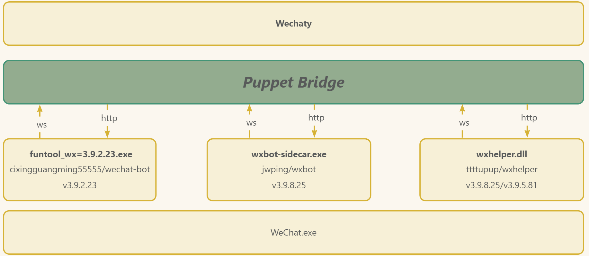

# Wechaty Puppet Bridge

  [](https://github.com/atorber/puppet-bridge/actions?query=workflow%3ANPM)
[](https://www.npmjs.com/package/wechaty-puppet-bridge)
[](https://www.npmjs.com/package/wechaty-puppet-bridge?activeTab=versions) 



## 简介

wechaty-puppet-bridge 是一个虚拟的Wechaty Puppet，实际上它只是一个桥接服务，它将GitHub中开源的机器人桥接到Wechaty，是开源IM bot搬运工

如果你想方便且高效的使用免费的机器人，那么它是一个很好的选择，它不需要token同时又能使用Wechaty进行聊天机器人开发

获取更多信息[访问项目语雀文档](https://www.yuque.com/atorber/chatflow/mean34ibdoonvox4)

## 快速开始

### 使用[jwping/wxbot](https://github.com/jwping/wxbot)

1. 在您的Windows电脑上安装客户端（需要版本v3.9.8.25,下载[v3.9.8.25](https://github.com/tom-snow/wechat-windows-versions/releases/tag/v3.9.8.25)）

2. 在电脑上登录客户端

3. 运行以下指令启动程序

```sh
git clone https://github.com/atorber/puppet-bridg
cd puppet-bridge

# 安装依赖
npm install

# 启动程序
npm run start:ripe-bridge-jwping-wxbot:info
#
# Do not forget to install WeChat with requried version and login.
#
```

## 使用NPM包

puppet-bridge 已经在NPM上发布了安装包，Wechaty用户可以直接安装使用

```shell
npm i wechaty-puppet-bridge
```

## 机器人支持

1. Wechat-bot 馈人玫瑰之手，历久犹有余香 [cixingguangming55555/wechat-bot](https://github.com/cixingguangming55555/wechat-bot)

2. wxbot - 聊天机器人 [jwping/wxbot](https://github.com/jwping/wxbot)

3. wxhelper - PC端微信逆向学习 [ttttupup/wxhelper](https://github.com/ttttupup/wxhelper)

4. WeChatFerry - 一个玩微信的工具 [lich0821/WeChatFerry](https://github.com/lich0821/WeChatFerry)

5. Gewechat -  Gewechat🤖，个人微信免费开源框架 [Devo919/Gewechat](https://github.com/Devo919/Gewechat)

## 功能清单

wechaty-puppet-bridge 是一个全新的wechaty-puppet，它可以连接所有的通过ws、http、mqtt开放IM访问的聊天机器人.

> 最新功能清单查看[功能清单](https://www.yuque.com/atorber/chatflow/imovlh1l8ypxmd9n#eTg6)

## 更多示例代码

|源|WeChat版本|使用|安装|
|--|--|--|--|
|[Devo919/Gewechat](https://github.com/Devo919/Gewechat)|iPad协议|[示例代码](./examples/ripe-wechaty-Devo919-Gewechat.ts) |npm i wechaty-puppet-bridge@0.16.0|
|[lich0821/WeChatFerry](https://github.com/lich0821/WeChatFerry)|v3.9.10.27|[示例代码](./examples/ripe-wechaty-lich0821-WeChatFerry-3091027.ts) |npm i wechaty-puppet-bridge@0.15.0|
|[jwping/wxbot](https://github.com/jwping/wxbot)|v3.9.8.25|[示例代码](./examples/ripe-wechaty-jwping-wxbot-3090825.ts)|npm i wechaty-puppet-bridge@0.15.0|
|[ttttupup/wxhelper](https://github.com/ttttupup/wxhelper/tree/dev-3.9.2.23)|v3.9.2.23|[示例代码](./examples/ripe-wechaty-ttttupup-wxhelper-3090223.ts) (需要【以管理员身份运行】WeChat客户端)|npm i wechaty-puppet-bridge@0.15.0|
|[ttttupup/wxhelper](https://github.com/ttttupup/wxhelper/tree/dev-3.9.5.81)|v3.9.5.81|[示例代码](./examples/ripe-wechaty-ttttupup-wxhelper-3090581.ts) (需要【以管理员身份运行】WeChat客户端)|npm i wechaty-puppet-bridge@0.15.0|
|[ttttupup/wxhelper](https://github.com/ttttupup/wxhelper/tree/dev-3.9.8.25)|v3.9.8.25|[示例代码](./examples/ripe-wechaty-atorber-fused-3090825.ts) (需要【以管理员身份运行】WeChat客户端)|npm i wechaty-puppet-bridge@0.15.0|
|[ttttupup/wxhelper](https://github.com/ttttupup/wxhelper/tree/dev-3.9.10.19)|v3.9.10.19|[示例代码](./examples/ripe-bridge-ttttupup-wxhelper-3091019.ts) (需要【以管理员身份运行】WeChat客户端)|npm i wechaty-puppet-bridge@0.15.0|

## API接口

Puppet Bridge是对开源bot项目的API封装，并不会对原生的API进行修改，因此你依然可以使用底层bot的原生API进行开发

[原生API使用说明](https://www.yuque.com/atorber/chatflow/wo5wzr75qdzs1t7p)

## 更新日志

### v0.15.0

- 支持lich0821/WeChatFerry

[更多版本记录详见](https://www.yuque.com/atorber/chatflow/hyy64kf0a0iguy68)

## 推荐

1. [wechatferry/wechatferry](https://github.com/wechatferry/wechatferry)项目完整的实现了[lich0821/WeChatFerry](https://github.com/lich0821/WeChatFerry)，并且作者制作了一个非常精美丰富的使用文档[https://wcferry.netlify.app/](https://wcferry.netlify.app/)

```javascript
import { WechatferryPuppet } from '@wechatferry/puppet'
import { WechatyBuilder } from 'wechaty'

const puppet = new WechatferryPuppet()
const bot = WechatyBuilder.build({ puppet })

bot.on('message', (msg) => {
  msg.text() === 'ding' && msg.say('dong')
})
  .start()
```
